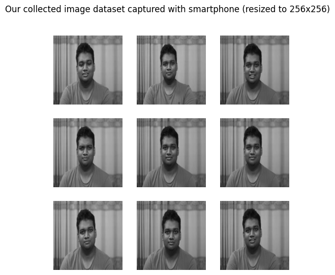
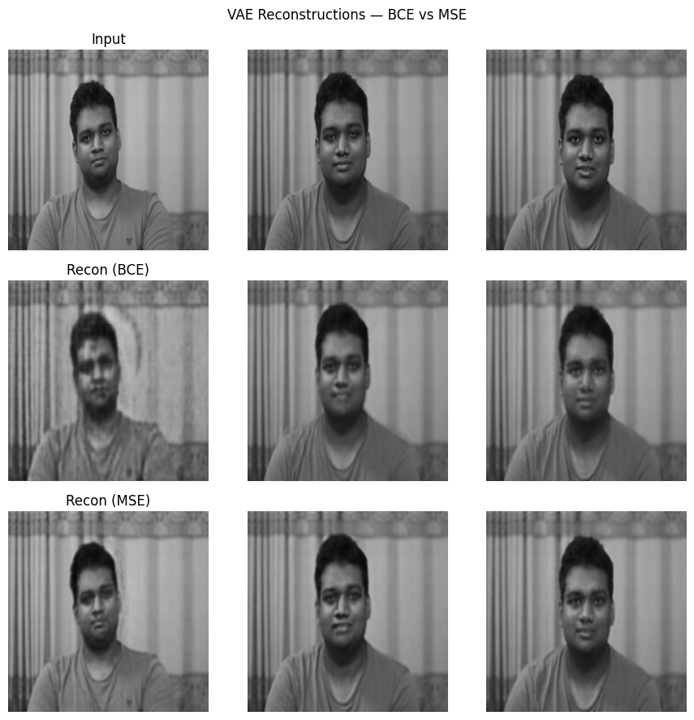
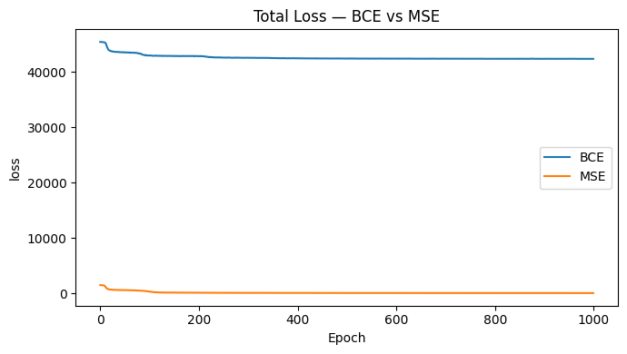
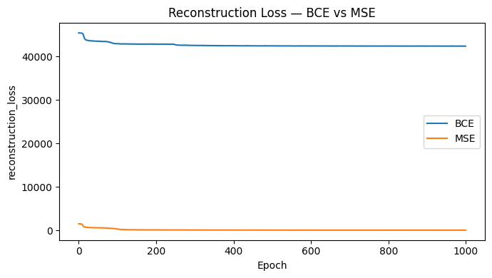
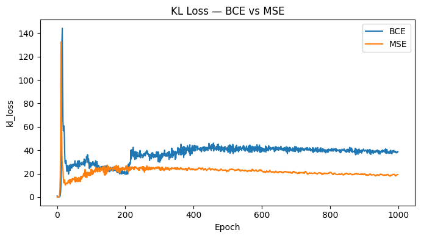
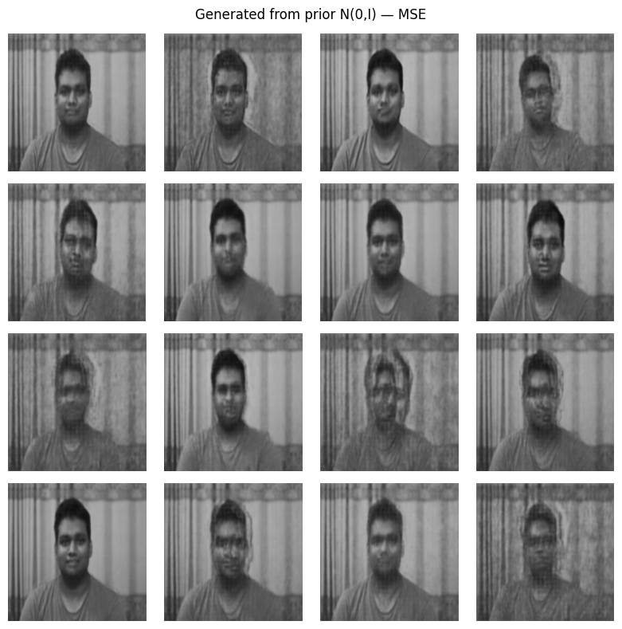
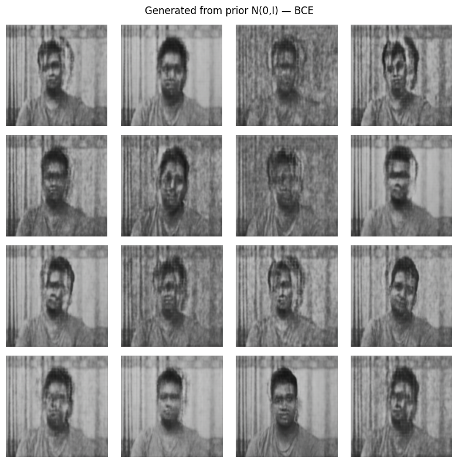

# 📦 Repository Name
**VAE-Phone-Object-Generator**

# 📝 Repository Description
A lightweight Variational Autoencoder (VAE) project trained on smartphone-captured images to generate synthetic samples, compare **BCE vs MSE** reconstruction losses, visualize training behavior, and demonstrate KL divergence in mean–variance form. Focused on visuals with minimal text.

---

# 📷 Sample Dataset

---

# 🔧 VAE Reconstructions (BCE vs MSE)

---

# 📉 Training Curves

### ✅ Total Loss  

### ✅ Reconstruction Loss  

### ✅ KL Divergence  

---

# 🧪 Generated Images From Prior Distribution

### 🎯 MSE-Trained Model  

### 🎯 BCE-Trained Model  

---

# 🧮 KL Divergence (Mean & Variance Form)

\[
D_{KL}(q||p)
= -\frac{1}{2}\sum_{i=1}^{d}
\left(1 + \log\sigma_i^2 - \mu_i^2 - \sigma_i^2\right)
\]

---

# ✔️ Quick Summary
- **BCE** → Sharper, higher-scale loss  
- **MSE** → Smoother, higher PSNR & SSIM  
- VAE successfully reconstructs + generates new samples  
- KL term regularizes latent distribution  

---
